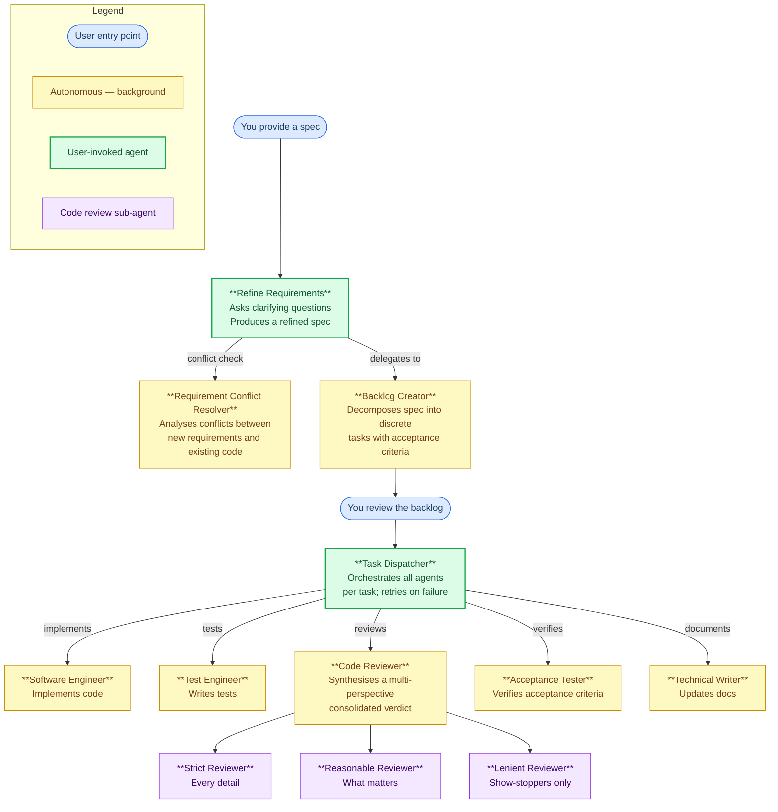

# Squadron

Squadron is an Agentic Coding Suite built specifically for **GitHub Copilot** and its **Premium Request billing model**.

It provides a team of autonomous, specialized agents that take a specification from idea to implementation - refining requirements, breaking work into tasks, writing code, testing, and documenting changes.

Humans provide the vision. Agents provide the implementation.

## Why Squadron Exists

Most agentic coding suites are designed for platforms with token-based billing. On those platforms, every optimization is measured in tokens: prompts are compressed, context windows are trimmed, and output is kept terse because tokens are the unit of cost.

GitHub Copilot works differently. Copilot bills by **Premium Request** - each time the model is prompted by the user counts as a request, regardless of how many tokens it uses. The token-optimizing strategies used by other agent frameworks actively work against you here: spawning subAgents via multiple prompts rapidly burn through your request quota.

**Squadron is designed from the ground up around this billing model.** Its defining characteristic is minimizing the number of model invocations. It achieves this by:

- **Using Copilot's native `agent` tool** to delegate work to background agents that run outside your active request context
- **Giving agents deep, complete context upfront** so they can complete work in a single pass without back-and-forth clarification

If you are using GitHub Copilot and paying per Premium Request, Squadron is built for you. If you are on a token-billed platform, other frameworks may serve you better.

## Getting Started

1. Open your project in VS Code with GitHub Copilot enabled
2. Run `npx squadron` in your project directory to install the agents and skills into `.github/agents/` and `.github/skills/`
3. Invoke the **Refine Requirements** agent with your specification to begin

## The Workflow

### Step 1: Refine Requirements

Invoke the **Refine Requirements** agent with your feature request, bug report, or specification. This agent:

- Researches your codebase for context
- Identifies ambiguities, gaps, and implicit assumptions
- Asks you clarifying questions to resolve them
- Produces a refined, unambiguous specification
- Delegates to the **Backlog Creator** to generate a task backlog
- Invokes the **Requirement Conflict Resolver** when new requirements may conflict with existing code; escalates unresolvable conflicts to you before proceeding

### Step 2: Review the Backlog

The **Backlog Creator** breaks the refined specification into small, discrete tasks — each with specific acceptance criteria, priority, and dependency ordering. Review the generated backlog in the `backlog/` directory. You can adjust tasks, priorities, or acceptance criteria before proceeding.

### Step 3: Execute with Task Dispatcher

Invoke the **Task Dispatcher** agent to begin implementation. For each task, it:

1. Delegates to **Test Engineer** to write tests first (TDD)
2. Delegates to **Software Engineer** to implement until the tests pass
3. Delegates to **Code Reviewer** for a multi-perspective code review (strict, reasonable, and lenient)
4. Delegates to **Acceptance Tester** for verification against acceptance criteria
5. Re-attempts implementation if the code review or acceptance criteria aren't met (up to 4 iterations)
6. Delegates to **Technical Writer** for documentation updates
7. Commits changes and updates the backlog

## Meet the Agents

### Refine Requirements
**Entry point** — the first agent you interact with. Performs deep analysis of your specification, asks clarifying questions to eliminate ambiguities, and ensures requirements are complete and implementable before any code is written.

### Requirement Conflict Resolver
Invoked automatically by Refine Requirements when a potential conflict between new requirements and the existing codebase is detected. Performs deep investigation of affected code paths, tests, and data flows. Returns one of three outcomes: resolved (with a concrete resolution strategy), false alarm (behaviors can coexist without changes), or unresolvable (escalated to the user with evidence and ruled-out alternatives before proceeding). Not directly user-invokable.

### Backlog Creator
Takes the refined specification and decomposes it into small, independently implementable tasks. Each task has specific acceptance criteria, priority, and dependency ordering. Creates structured backlog files in the `backlog/` directory.

### Task Dispatcher
The engineering manager. Reads the backlog, selects tasks in dependency and priority order, delegates to specialist agents, and ensures each task passes acceptance testing before marking it complete. Handles retries and escalation for blocked tasks.

### Software Engineer
Implements a single task from the backlog. Researches the codebase, writes production-quality code following project conventions, and verifies changes pass existing tests.

### Test Engineer
Writes comprehensive tests for implemented features. Covers happy paths, edge cases, and error scenarios following the project's testing framework and conventions.

### Acceptance Tester
Verifies that implementations meet their acceptance criteria. Reviews code changes, runs the test suite, and reports detailed pass/fail findings for each criterion.

### Code Reviewer
Orchestrates a multi-perspective code review by delegating to three sub-agents — Strict, Reasonable, and Lenient reviewers. Synthesizes their findings into a consolidated verdict using a confidence framework: issues found by all three reviewers are confirmed legitimate, issues found only by the strict reviewer are treated as optional nitpicks. Determines whether code needs rework or can proceed.

### Strict Reviewer
The nitpicky reviewer. Examines every line for correctness, code quality, convention adherence, edge cases, and readability. Flags everything — no detail is too small. Findings that only this reviewer catches are classified as nitpicks in the consolidated review.

### Reasonable Reviewer
The pragmatic reviewer. Focuses on what matters for long-term codebase health: correctness, security vulnerabilities, maintainability concerns, and non-idiomatic code. Ignores trivial stylistic preferences.

### Lenient Reviewer
The quick-scan reviewer. Only flags show-stopping issues — broken logic, security holes, and catastrophic problems. Everything else is off its radar. If this reviewer flags something, it's serious.

### Technical Writer
Maintains project documentation. Updates README files, changelogs, API documentation, and other docs to accurately reflect completed changes.

## Skills

### Agent Backlog Maintenance
Defines the schema, file format, naming conventions, and lifecycle rules for the task backlog. Used by the Backlog Creator and Task Dispatcher to ensure consistent backlog management.

### Commit to Git
Defines commit message formatting ([Conventional Commits](https://www.conventionalcommits.org/)), branch naming conventions, and commit scope guidelines. Used by the Task Dispatcher when committing completed work.

### Review Findings
Defines the standard report format for all reviewer agents. Specifies severity profiles for each reviewer type (Strict, Reasonable, Lenient) and the mandatory recommendation line (`PASS` / `REWORK NEEDED`) that the Code Reviewer uses to synthesise findings consistently.

## Design Principles

- **Specialization**: each agent has one job and does it well
- **Autonomy**: agents work independently within their defined scope
- **Quality gates**: every task passes acceptance testing before completion
- **Human oversight**: humans review requirements and the backlog before implementation begins
- **Context efficiency**: sub-agents receive only the context they need, keeping context windows small
- **Cost optimization**: work is delegated to specialized sub-agents via the `agent` tool, minimizing token usage per Premium Request
